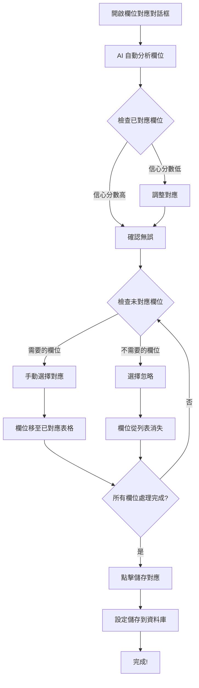

# 📘 AI 欄位對應使用指南

> 如何手動設定未對應的欄位

---

## 🎯 快速指南

### 步驟 1: 開啟欄位對應對話框

1. 進入 Dashboard →「資料來源同步」頁籤
2. 在「對應設定」區域設定工作表的 Supabase 表對應
3. 在「已設定的對應」列表中，點擊工作表右側的「✨ 欄位對應」按鈕

### 步驟 2: 檢視 AI 建議的對應

對話框開啟後會自動分析欄位，你會看到：

**📊 已自動對應的欄位（上方表格）**
- 顯示 AI 成功對應的欄位
- 每個對應都有信心分數（綠色 ≥80%、黃色 50-79%、紅色 <50%）
- 可以使用下拉選單調整對應

**⚠️ 未對應的欄位（下方黃色區域）**
- 顯示無法自動對應的欄位
- 提供手動設定介面

### 步驟 3: 手動設定未對應的欄位

對於未對應的欄位，你有兩個選擇：

#### 選項 A: 對應到 Supabase 欄位

1. 在未對應欄位區域，找到你要對應的 Google Sheets 欄位
2. 點擊右側的下拉選單「選擇對應欄位或忽略」
3. 從列表中選擇對應的 Supabase 欄位
4. 該欄位會立即移動到上方的「已對應」表格中

#### 選項 B: 忽略欄位

1. 在下拉選單中選擇「⊗ 忽略此欄位」
2. 該欄位會被忽略，不會儲存到資料庫

### 步驟 4: 調整已對應的欄位

**修改對應：**
- 在已對應表格中，點擊「Supabase 欄位」欄的下拉選單
- 選擇新的對應欄位

**移除手動對應：**
- 對於手動設定的欄位（信心分數為 0%），右側會出現「×」按鈕
- 點擊「×」可移除對應，欄位會回到未對應列表

### 步驟 5: 儲存設定

1. 檢查所有對應是否正確
2. 點擊右下角的「💾 儲存對應」按鈕
3. 系統會將對應設定儲存到資料庫
4. 看到「儲存成功」的通知後，對話框會自動關閉

---

## 📋 完整範例

### 範例：設定「EODs for Closers」工作表

#### 初始狀態

**已自動對應（AI 建議）：**
- 學員姓名（諮詢） → student_name (90%)
- Email（諮詢） → student_email (90%)
- 成交日期 → deal_date (70%)

**未對應的欄位：**
- （諮詢）電話負責人
- （諮詢）諮詢人員
- （諮詢）諮詢結果
- （諮詢）成交方案
- （諮詢）實收金額
- 月份、年份、週別
- #VALUE!、TRUE (錯誤值)

#### 手動設定步驟

1. **對應重要欄位：**
   - 「（諮詢）諮詢人員」→ 選擇「closer_name」
   - 「（諮詢）諮詢結果」→ 選擇「consultation_result」
   - 「（諮詢）實收金額」→ 選擇「actual_amount」

2. **忽略不需要的欄位：**
   - 「月份」→ 選擇「⊗ 忽略此欄位」
   - 「年份」→ 選擇「⊗ 忽略此欄位」
   - 「週別」→ 選擇「⊗ 忽略此欄位」
   - 「#VALUE!」→ 選擇「⊗ 忽略此欄位」
   - 「TRUE」→ 選擇「⊗ 忽略此欄位」

3. **調整 AI 建議：**
   - 如果「成交日期」對應錯誤，在表格中改為「deal_date」

4. **儲存設定**

#### 最終結果

**已對應（將會儲存）：**
- 學員姓名（諮詢） → student_name (AI 建議, 90%)
- Email（諮詢） → student_email (AI 建議, 90%)
- 成交日期 → deal_date (AI 建議, 70%)
- （諮詢）諮詢人員 → closer_name (手動設定, 0%)
- （諮詢）諮詢結果 → consultation_result (手動設定, 0%)
- （諮詢）實收金額 → actual_amount (手動設定, 0%)

**已忽略（不會儲存）：**
- 月份、年份、週別、#VALUE!、TRUE

---

## 🎨 介面說明

### 欄位對應表格

```
┌─────────────────────────────────────────────────────────────────────┐
│ Google Sheets 欄位 │ → │ Supabase 欄位 │ 信心 │ 原因     │ 操作 │
├─────────────────────────────────────────────────────────────────────┤
│ 學員姓名（諮詢）   │ → │ student_name  │ 90% │ 姓名匹配 │      │
│ Email（諮詢）     │ → │ student_email │ 90% │ Email 匹配│     │
│ （諮詢）諮詢人員   │ → │ closer_name   │ 0%  │ 手動設定  │  ×  │
└─────────────────────────────────────────────────────────────────────┘
```

### 未對應欄位區域

```
┌──────────────────────────────────────────────────────────────┐
│ ⚠️ 未對應的欄位                                              │
│ 以下欄位無法自動對應，您可以手動選擇對應的 Supabase 欄位或選擇「忽略」│
├──────────────────────────────────────────────────────────────┤
│ （諮詢）電話負責人 → [選擇對應欄位或忽略 ▼]                   │
│ （諮詢）諮詢結果   → [選擇對應欄位或忽略 ▼]                   │
│ 月份              → [選擇對應欄位或忽略 ▼]                   │
└──────────────────────────────────────────────────────────────┘
```

---

## 💡 實用技巧

### 1. 優先對應重要欄位
- 先設定必填欄位（如 student_name, student_email）
- 再設定業務關鍵欄位（如金額、日期）
- 最後處理輔助欄位

### 2. 忽略無用欄位
以下類型的欄位建議忽略：
- 空白欄位
- 錯誤值（#VALUE!、#REF!、#N/A）
- 布林值欄位（TRUE、FALSE）
- 計算用的輔助欄位（月份、年份、週別）
- 已經包含在其他欄位的資料

### 3. 檢查信心分數
- **綠色 (≥80%)**：通常正確，但仍建議檢查
- **黃色 (50-79%)**：可能正確，建議仔細檢查
- **紅色 (<50%)**：不確定，務必手動確認
- **0%**：手動設定的欄位

### 4. 使用有意義的欄位名稱
如果 Google Sheets 欄位名稱太簡短或含糊：
- 在 Google Sheets 中重新命名欄位會更好
- 重新同步後 AI 會有更高的信心分數

### 5. 批量處理
如果有多個類似的工作表：
1. 先設定一個工作表的對應
2. 記錄對應規則
3. 在設定其他工作表時參考

---

## ❓ 常見問題

### Q1: 為什麼有些欄位無法自動對應？

**A:** 可能的原因：
- 欄位名稱與 Supabase 欄位差異太大
- 欄位名稱含糊不清（如「備註」、「其他」）
- 欄位名稱包含特殊字符或符號
- Supabase 表中沒有對應的欄位

### Q2: 我可以修改 AI 建議的對應嗎？

**A:** 可以！在已對應表格中，每個「Supabase 欄位」都是下拉選單，可以自由修改。

### Q3: 忽略的欄位會發生什麼事？

**A:**
- 忽略的欄位不會儲存到 `field_mappings` 表
- 資料同步時會跳過這些欄位
- 原始資料仍會保留在 `raw_data` 欄位中

### Q4: 手動設定的對應可以刪除嗎？

**A:** 可以！手動設定的欄位（信心分數 0%）右側會有「×」按鈕，點擊可移除對應。

### Q5: 儲存後可以再修改嗎？

**A:** 可以！再次開啟欄位對應對話框，系統會載入已儲存的對應，你可以繼續修改。

### Q6: 對應設定何時生效？

**A:** 儲存對應後，下次資料同步時就會使用新的對應規則進行轉換。

---

## 🔄 完整工作流程



---

## 📞 需要幫助？

如果遇到問題：

1. **檢查 Supabase 表結構**
   - 確認目標表已存在
   - 確認欄位名稱正確

2. **查看控制台錯誤**
   - 按 F12 開啟開發者工具
   - 查看 Console 和 Network 標籤

3. **重新分析**
   - 關閉對話框後重新開啟
   - AI 會重新分析欄位

4. **檢查原始資料**
   - 在 Google Sheets 中確認欄位名稱
   - 確認欄位有實際資料

---

## 🎉 快速參考

### 操作清單

- [ ] 開啟欄位對應對話框
- [ ] 檢查 AI 自動對應（綠色徽章優先）
- [ ] 調整信心分數低的對應（黃色、紅色徽章）
- [ ] 手動設定未對應的重要欄位
- [ ] 忽略不需要的欄位
- [ ] 移除錯誤的手動對應
- [ ] 儲存設定
- [ ] 執行資料同步驗證

### 徽章顏色說明

| 顏色 | 信心分數 | 建議動作 |
|-----|---------|---------|
| 🟢 綠色 | ≥ 80% | 通常正確，建議檢查 |
| 🟡 黃色 | 50-79% | 可能正確，仔細檢查 |
| 🔴 紅色 | < 50% | 不確定，務必確認 |
| ⚪ 灰色 | 0% | 手動設定，可移除 |

---

**祝你使用愉快！** 🚀
