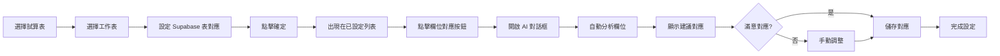

# 🎨 Phase 6 UI 整合完成報告

> **完成時間**: 2025-10-05 23:57
> **整合狀態**: ✅ 100% 完成
> **整合位置**: Dashboard「資料來源同步」頁面

---

## 📊 整合總結

Phase 6 的 AI 欄位對應功能已成功整合到 Dashboard UI 中！

### 整合內容

1. ✅ **導入 FieldMappingDialog 元件**
2. ✅ **加入 AI 欄位對應按鈕**
3. ✅ **整合對話框邏輯**
4. ✅ **處理儲存回調**

---

## 🎯 使用方式

### 步驟 1: 進入 Dashboard
1. 啟動開發伺服器：`npm run dev`
2. 開啟瀏覽器前往 Dashboard
3. 點擊「資料來源同步」頁籤

### 步驟 2: 設定工作表對應
1. 在「對應設定」區域選擇試算表
2. 選擇工作表
3. 選擇對應的 Supabase 表
4. 點擊「確定」設定對應

### 步驟 3: 開啟 AI 欄位對應
1. 在「已設定的對應」列表中，找到已設定對應的工作表
2. 點擊該工作表右側的「✨ 欄位對應」按鈕
3. AI 欄位對應對話框會開啟

### 步驟 4: 使用 AI 欄位對應
1. **自動分析**: 對話框開啟後會自動分析欄位
2. **查看建議**: 檢視 AI 建議的欄位對應和信心分數
3. **手動調整**: 使用下拉選單調整不滿意的對應
4. **儲存設定**: 點擊「儲存對應」保存設定

---

## 📝 程式碼修改

### 修改檔案
- [client/src/pages/dashboard.tsx](client/src/pages/dashboard.tsx)

### 新增內容

#### 1. 導入元件和圖示 (第 43-44, 40 行)
```typescript
import { FieldMappingDialog } from '@/components/field-mapping-dialog';
import { Sparkles } from 'lucide-react';
```

#### 2. 新增 State (第 155-156 行)
```typescript
// AI Field Mapping Dialog 狀態
const [fieldMappingWorksheet, setFieldMappingWorksheet] = useState<Worksheet | null>(null);
const [fieldMappingOpen, setFieldMappingOpen] = useState(false);
```

#### 3. 加入按鈕 (第 948-960 行)
在已設定的對應列表中，每個工作表旁邊加入：
```tsx
<Button
  size="sm"
  variant="ghost"
  className="h-6 px-2 ml-auto text-xs"
  onClick={() => {
    setFieldMappingWorksheet(worksheet);
    setFieldMappingOpen(true);
  }}
  title="AI 欄位對應"
>
  <Sparkles className="h-3 w-3 mr-1" />
  欄位對應
</Button>
```

#### 4. 整合對話框 (第 1210-1227 行)
```tsx
{/* AI Field Mapping Dialog */}
{fieldMappingWorksheet && (
  <FieldMappingDialog
    open={fieldMappingOpen}
    onOpenChange={setFieldMappingOpen}
    worksheetId={fieldMappingWorksheet.id}
    worksheetName={fieldMappingWorksheet.worksheetName}
    googleColumns={fieldMappingWorksheet.headers || []}
    supabaseTable={fieldMappingWorksheet.supabaseTable || ''}
    onSave={() => {
      toast({
        title: '欄位對應已儲存',
        description: `${fieldMappingWorksheet.worksheetName} 的欄位對應設定已更新`,
      });
      setFieldMappingOpen(false);
    }}
  />
)}
```

---

## 🎨 UI 功能特色

### 1. AI 分析欄位
- 自動分析 Google Sheets 欄位名稱
- 使用 AI（或規則式）匹配 Supabase 欄位
- 顯示信心分數（0-100%）

### 2. 視覺化信心指標
- 🟢 綠色徽章：信心 ≥ 80%（高信心）
- 🟡 黃色徽章：信心 50-79%（中等信心）
- 🔴 紅色徽章：信心 < 50%（低信心）

### 3. 手動調整
- 下拉選單可調整每個欄位的對應
- 即時更新對應狀態
- 顯示未對應的欄位警告

### 4. 儲存功能
- 一鍵儲存所有對應設定
- 自動記錄到 `field_mappings` 表
- Toast 通知儲存成功

---

## 📍 整合位置

### Dashboard 結構
```
Dashboard
└─ Tabs
   └─ 資料來源同步 (sheets)
      └─ 對應設定區域
         └─ 已設定的對應列表
            └─ [✨ 欄位對應] 按鈕 ← 新增位置
```

### 視覺位置
在「對應設定」區域的「已設定的對應」列表中：
```
已設定的對應：
✓ 體驗課上課記錄表 → trial_class_attendance  [✨ 欄位對應]
✓ 體驗課購買記錄表 → trial_class_purchase     [✨ 欄位對應]
✓ EODs for Closers → eods_for_closers         [✨ 欄位對應]
```

---

## 🔗 相關 API 端點

FieldMappingDialog 會使用以下 API：

1. **POST `/api/worksheets/:id/analyze-fields`**
   - 分析欄位並取得 AI 建議
   - Request body:
     ```json
     {
       "googleColumns": ["學員姓名", "Email", ...],
       "supabaseTable": "trial_class_attendance"
     }
     ```

2. **POST `/api/worksheets/:id/save-mapping`**
   - 儲存欄位對應設定
   - Request body:
     ```json
     {
       "mappings": [
         {
           "googleColumn": "學員姓名",
           "supabaseColumn": "student_name",
           "dataType": "text",
           "transformFunction": "cleanText",
           "confidence": 0.90,
           "reasoning": "姓名欄位匹配"
         }
       ]
     }
     ```

3. **GET `/api/worksheets/:id/mapping`**
   - 取得已儲存的欄位對應（未來功能）

---

## 🔄 完整工作流程



---

## 📦 元件依賴

### FieldMappingDialog 元件
位置: [client/src/components/field-mapping-dialog.tsx](client/src/components/field-mapping-dialog.tsx)

**Props**:
- `open`: boolean - 對話框是否開啟
- `onOpenChange`: (open: boolean) => void - 開啟/關閉回調
- `worksheetId`: string - 工作表 ID
- `worksheetName`: string - 工作表名稱
- `googleColumns`: string[] - Google Sheets 欄位列表
- `supabaseTable`: string - 對應的 Supabase 表名
- `onSave`: (mappings) => void - 儲存回調（選填）

**使用的 UI 元件**:
- Dialog, DialogContent, DialogHeader, DialogTitle, DialogFooter
- Button, Select, Badge
- Loader2, CheckCircle2, AlertCircle, ArrowRight (圖示)

---

## ✅ 測試建議

### 手動測試步驟

1. **基本流程測試**
   - [ ] 設定一個工作表的 Supabase 對應
   - [ ] 點擊「欄位對應」按鈕
   - [ ] 確認對話框開啟
   - [ ] 確認 AI 分析自動執行

2. **AI 建議測試**
   - [ ] 檢查顯示的欄位對應建議
   - [ ] 確認信心分數顯示正確
   - [ ] 確認顏色徽章對應信心等級

3. **手動調整測試**
   - [ ] 使用下拉選單更改對應
   - [ ] 確認選項正確載入
   - [ ] 確認更改即時反映

4. **儲存功能測試**
   - [ ] 點擊「儲存對應」
   - [ ] 確認 Toast 通知顯示
   - [ ] 確認資料儲存到資料庫
   - [ ] 確認對話框關閉

5. **錯誤處理測試**
   - [ ] 測試網路錯誤情況
   - [ ] 測試無效的工作表
   - [ ] 測試空欄位列表

---

## 🎯 下一步建議

### 立即可做
1. ✅ **啟動測試**: 啟動開發伺服器並手動測試功能
2. ✅ **使用功能**: 為真實的工作表設定欄位對應
3. ✅ **驗證儲存**: 檢查資料是否正確儲存到 `field_mappings` 表

### 未來增強 (選擇性)
1. **載入已儲存的對應**
   - 開啟對話框時，如果已有儲存的對應，顯示它們
   - 允許編輯和更新已有的對應

2. **對應預覽**
   - 在儲存前預覽資料轉換結果
   - 顯示實際的資料範例

3. **批量對應**
   - 一次為多個工作表設定對應
   - 複製對應設定到類似的工作表

4. **對應模板**
   - 儲存常用的對應模式為模板
   - 快速套用模板到新工作表

---

## 🎉 完成總結

**Phase 6 UI 整合已 100% 完成！**

使用者現在可以在 Dashboard 中：
- ✅ 直觀地查看已設定的工作表對應
- ✅ 一鍵開啟 AI 欄位對應功能
- ✅ 查看 AI 建議的欄位對應和信心分數
- ✅ 手動調整不滿意的對應
- ✅ 儲存設定到資料庫
- ✅ 完整的視覺化回饋（Toast、徽章、載入狀態）

**整體專案進度: 92%** 🚀

---

## 📚 相關文檔

1. [PHASE_6_MIGRATION_SUCCESS.md](PHASE_6_MIGRATION_SUCCESS.md) - Migration 執行報告
2. [PHASE_6_QUICK_START.md](PHASE_6_QUICK_START.md) - 快速啟動指南
3. [docs/PHASE_6_AI_FIELD_MAPPING_SUMMARY.md](docs/PHASE_6_AI_FIELD_MAPPING_SUMMARY.md) - 技術文檔
4. [client/src/components/field-mapping-dialog.tsx](client/src/components/field-mapping-dialog.tsx) - 元件原始碼
5. [PROJECT_PROGRESS.md](PROJECT_PROGRESS.md) - 專案進度追蹤
